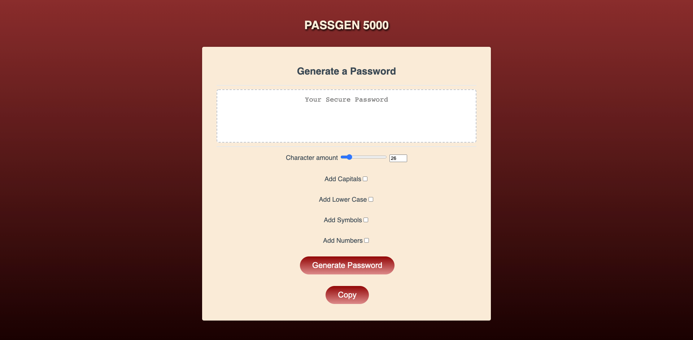

# Gizem

## Description

    For this project I needed to write the javascript to create a functioning password generator that would allow you to randomly produce passwords with upper and lower case letters as well as symbols and numbers. I learned how to create a working generate button that checks the parameters specified by check boxes and a range slider. Also, I was able to call a funtion to run in another function allowing the generated password to display. 

## Installation

* copy ssh key from [https://github.com/Jahbeezy/Gizem] and use git clone to download the file.

## Usage

* Open up the webpage [https://jahbeezy.github.io/Gizem/]
and select atleast one of the parameters.
* Slide the Character Amount to desired number
* Use Copy button to copy the password to your clipboard

 

## Credits

[https://www.youtube.com/watch?v=iKo9pDKKHnc&ab_channel=WebDevSimplified]

[https://www.youtube.com/watch?v=-Dog-Wd_RLw&ab_channel=Omerko]

[https://developer.mozilla.org/en-US/docs/Web/JavaScript]

[https://www.w3schools.com/js/default.asp]

## Liscence

    MIT License

    Copyright (c) [year] [fullname]

    Permission is hereby granted, free of charge, to any person obtaining a copy
    of this software and associated documentation files (the "Software"), to deal
    in the Software without restriction, including without limitation the rights
    to use, copy, modify, merge, publish, distribute, sublicense, and/or sell
    copies of the Software, and to permit persons to whom the Software is
    furnished to do so, subject to the following conditions:

    The above copyright notice and this permission notice shall be included in all
    copies or substantial portions of the Software.

    THE SOFTWARE IS PROVIDED "AS IS", WITHOUT WARRANTY OF ANY KIND, EXPRESS OR
    IMPLIED, INCLUDING BUT NOT LIMITED TO THE WARRANTIES OF MERCHANTABILITY,
    FITNESS FOR A PARTICULAR PURPOSE AND NONINFRINGEMENT. IN NO EVENT SHALL THE
    AUTHORS OR COPYRIGHT HOLDERS BE LIABLE FOR ANY CLAIM, DAMAGES OR OTHER
    LIABILITY, WHETHER IN AN ACTION OF CONTRACT, TORT OR OTHERWISE, ARISING FROM,
    OUT OF OR IN CONNECTION WITH THE SOFTWARE OR THE USE OR OTHER DEALINGS IN THE
    SOFTWARE.